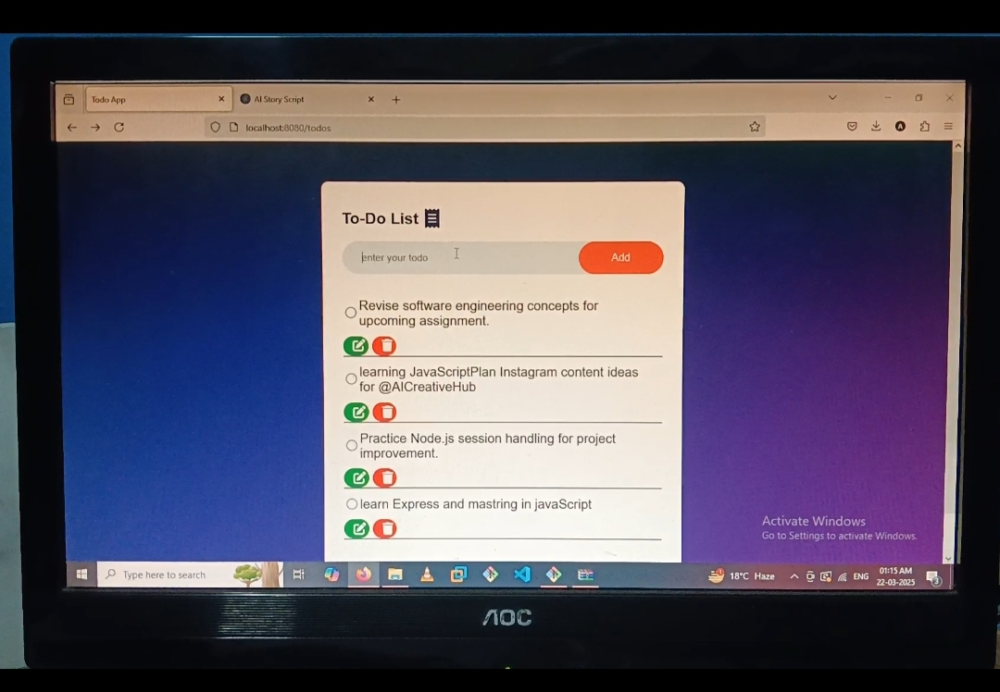

Create TodoApp by using# TodoApp 📝

Welcome to **TodoApp**! 🚀 This is a simple yet feature-rich task management application built using the **MERN Stack** (MongoDB, Express, React, Node.js). The app is designed to help you stay organized and productive. 🎉

---

## 🌟 Features

### 🔐 Validations:
- **Client-Side Validation:** Ensures a smooth and error-free user experience by validating inputs right in the browser. 🖥️
- **Server-Side Validation:** Adds an extra layer of security to validate data on the server before saving to the database. 🛡️

### 🎨 Animations:
- Engaging animations to make the app more interactive and visually appealing. ✨

### 📋 Core Features:
- **Add Tasks:** Easily add tasks with a title and description.
- **Mark as Completed:** Keep track of tasks by marking them as done. ✅
- **Delete Tasks:** Remove tasks you no longer need. 🗑️
- **Edit Tasks:** Update tasks to ensure they're always accurate. ✏️

---

## 🚀 Technologies Used

### Frontend:
- **React.js**: For building an interactive and dynamic user interface.
- **CSS/Animations**: For styling and smooth animations.

### Backend:
- **Node.js**: As the runtime environment.
- **Express.js**: For building the server-side API.

### Database:
- **MongoDB**: For storing tasks and user data.

### Additional Libraries:
- **EJS**: For server-side templating.
- **Joi**: For schema-based data validation.
- **Method-Override**: For supporting PUT and DELETE methods in forms.
- **Mongoose**: For object data modeling with MongoDB.

---

## 🎯 How to Get Started

### 1️⃣ Prerequisites:
Make sure you have the following installed:
- [Node.js](https://nodejs.org/)
- [MongoDB](https://www.mongodb.com/)

### 2️⃣ Installation:
1. Clone the repository:
   ```bash
   git clone https://github.com/your-username/todoapp.git
   ```
2. Navigate to the project folder:
   ```bash
   cd todoapp
   ```

3. Install dependencies for the backend:
   ```bash
   npm install
   ```
   
### 3️⃣ Run the Application:
1. Start the mongodb server:
   ```bash
   mongod
   ```

2. Start the frontend server:
   ```bash
   nodemon/node index.js
   ```

3. Open your browser and navigate to `http://localhost:8080`.
---

## 🎥 Demo


---

## Screenshots



## 💡 Key Learnings
- Building a full-stack application using the MERN stack.
- Implementing both client-side and server-side validation.
- Enhancing user experience with animations and responsive design.
- Structuring a project for scalability and maintainability.

---

## 📌 Future Enhancements
- Add user authentication (Login/Signup).
- Implement categories or tags for tasks.
- Add dark mode. 🌙
- Integrate push notifications for task reminders. 🔔

---

## 🤝 Contributing

Contributions are always welcome! Feel free to open an issue or submit a pull request. 😊

---

## 🛠️ Tools and Resources
- **Postman**: For API testing.
- **Git**: For version control.
- **VS Code**: For coding and debugging.

---

## 📧 Contact
If you have any questions or suggestions, feel free to reach out:
- **Email**: your-email@example.com
- **GitHub**: [YourUsername](https://github.com/your-username)

---

**Thank you for checking out TodoApp! Let’s get things done! 🚀**
 ME(CSS)N-(Mongodb Express CSS & Node)  
